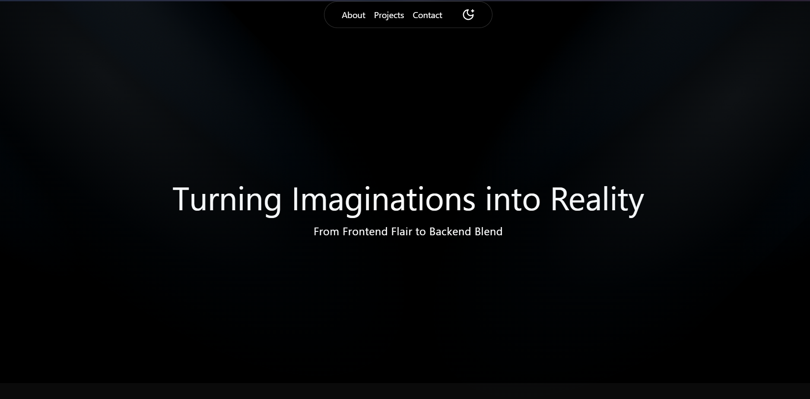
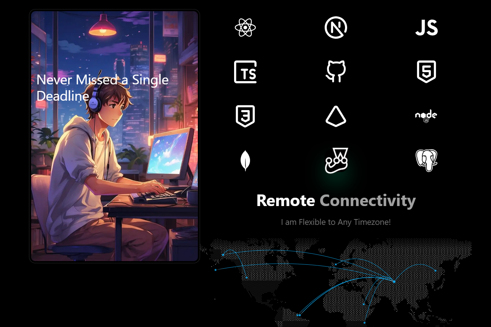

# 🌟 Welcome to My Portfolio 👋
    

## 🚀 About This Portfolio
This portfolio is more than just a webpage—it's a showcase of my skills, journey, and passion for web development. Built with:

🛠 Next.js, TypeScript, and Tailwind CSS for a fast, modern, and responsive experience
🎭 Framer Motion for smooth and interactive animations
🎨 Acternity UI for a sleek and polished design

## ✨ What's Inside? 👀

🌍 A warm welcome with a tagline and a floating Navbar featuring a theme toggler
⏳ A Timeline showcasing my journey and achievements 🏆
🛠 A Tech Stack section displaying the modern technologies I use to build scalable applications
🕒 A world map showing my flexibility with different time zones
🔗 A floating social menu to stay connected
🎥 Dynamic Animations
This site is packed with sleek and smooth animations—so much so that you might discover a new one with every visit! 🎭
And don’t worry—it’s all optimized for performance ⚡, ensuring a buttery smooth experience without slowdowns.

### ⭐ Show Some Love!
If you enjoyed exploring, drop a star ⭐ on this repo! Every bit of support means a lot! 💖
